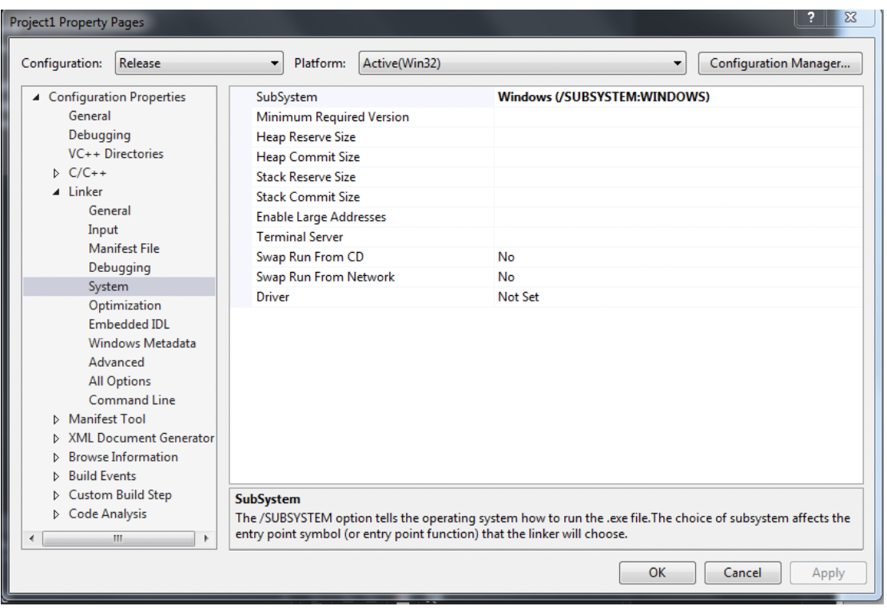

# **Particle Simulator**

**Ashay Changwani**
___
This project is Part 1 of my simulation series:

[Part 2 - Spring Simulation](http://github.com/ashaychangwani/springSimulation)

[Part 3 - Rope Simulation](http://github.com/ashaychangwani/ropeSimulation)

For this project, I will create a 2D particle simulator.

___
1. **Task 1 – Integration Schemes**

These were done based on the formulae taught in class with the exception of the Verlet
Velocity integration algorithm. For Verlet integration, we have two options for the calculation
of position. One is velocity independent and the other is dependent on the velocity. Since we
are anyway computing and tracking the velocity, I chose to use that formula since both seem
equivalent according to the slides.

2. **Task 2 – Energy Computation**

Our first task is to reset the energies in this method, else they can keep cumulating
infinitely. Next, we use the simple

Kinetic Energy = 𝑚𝑣^2 / 2

where m is the mass and v is the magnitude of the velocity

For potential energy, we had to create a constant for gravity at 9.81m/s^2

And use the formula:

Potential Energy = 𝑚𝑔ℎ

Where m is the mass, g is the gravitational constant, and height is (as per the hint) equal to
p.getPosition().getY() + this−>halfWorld.getY()

3. **Task 3 – Comparison**

When executing with different integration schemes, we come across a very notable observation
based on the value reported as the total energy of the system.

When executing with Euler integration scheme, the total energy keeps **increasing** even without
external interference.

When executing with Euler Cromer integration scheme, the total energy keeps **decreasing** even
without external interference.

With the Verlet velocity integration scheme, the total energy **stays almost constant** unless
there is an external interference like a bounce.

This information tracks with the slides which show us that Euler and Euler Cromer have an error
order of 𝑂(ℎ^2 ) compared to Verlet velocity integration scheme which has an error order of
𝑂(ℎ^3 ).

This demonstrates how our system is way more stable in the third scheme than in the first two.

# OPENGL	SETUP

- Download shared files
- Create a new folder, e.g. GL_Folder, to put the content ( glew and freeglut)
- Create an empty C++ project in Visual studio (see below).

- Right click Project &rarr; Properties &rarr;Configuration Properties &rarr; VC++ Directories &rarr;Include Directories:
    Select **_Include_** folders of both glew and freeglut
- Configuration Properties &rarr; Linker &rarr; Input:
    Additional Dependencies:
    Write: **_glew32.lib_** and **_freeglut.lib_**
- Configuration Properties &rarr; Linker &rarr; General:
    Additional Library Directories:
    Select **_lib_** folders of both glew and freeglut
- Copy **_glew32.dll_** and **_freeglut.dll_** from GL_Folder and paste them to your project folder

`
Be sure that your subsystem is Windows:
`

`
And your character set is set to: Not Set
`

